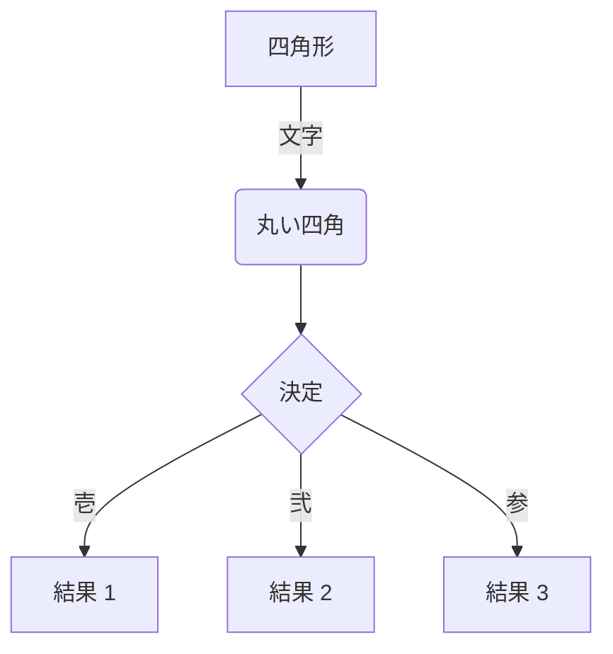
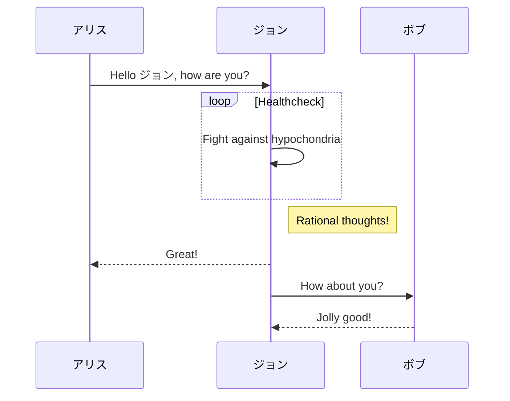

# mermaid-practice

```mermaid
flowchart TB

A[四角形] -->|文字| B(丸い四角)
B --> C{決定}
C -->|壱| D[結果 1]
C -->|弐| E[結果 2]
C -->|参| F[結果 3]
```

```mermaid
sequenceDiagram
アリス->>ジョン: Hello ジョン, how are you?
loop Healthcheck
    ジョン->>ジョン: Fight against hypochondria
end
Note right of ジョン: Rational thoughts!
ジョン-->>アリス: Great!
ジョン->>ボブ: How about you?
ボブ-->>ジョン: Jolly good!
```
