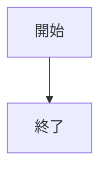
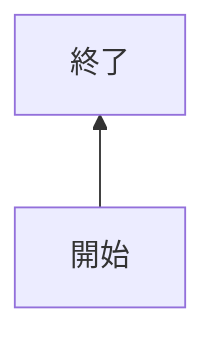
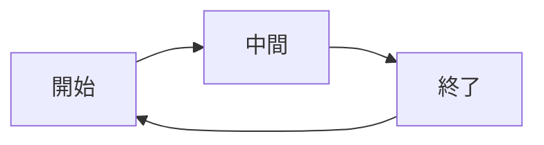
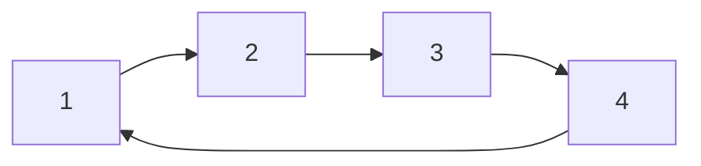
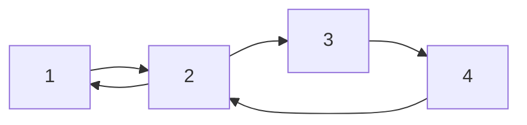
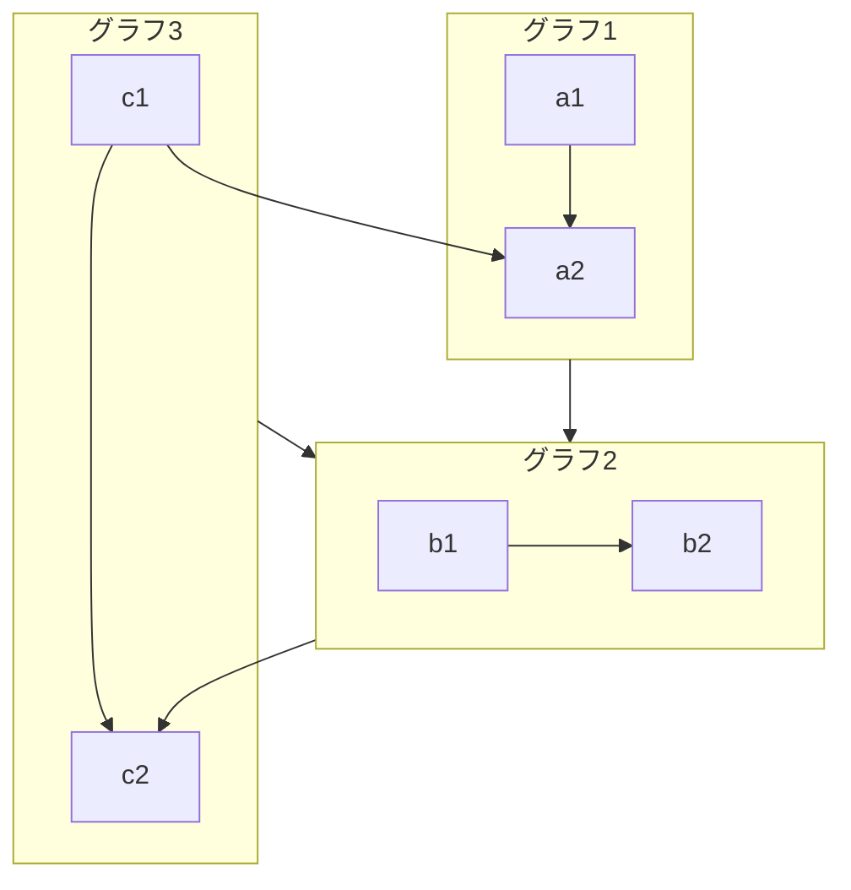
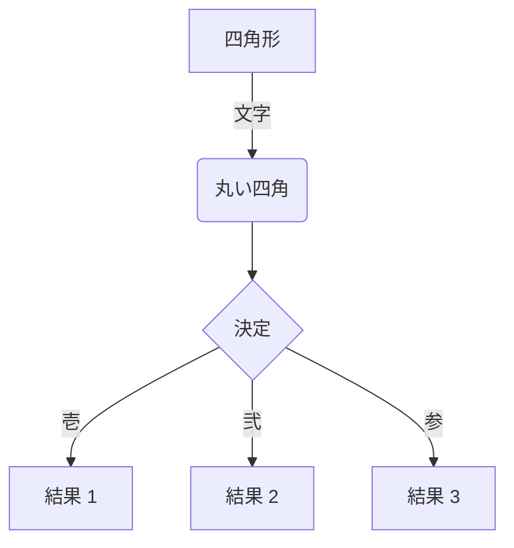
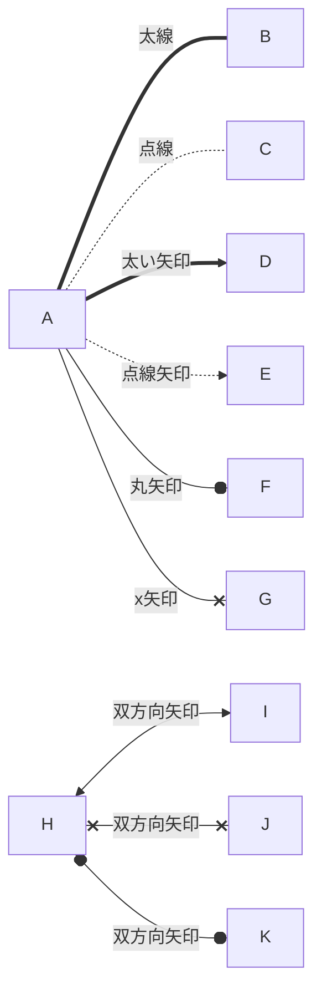

# フローチャート(TD,BT,LR,RL)

フローチャートの方向

```
TB : top to bottom
TD : top-down/ same as top to bottom
BT : bottom to top
RL : right to left
LR : left to right
```







---

ぐるぐる回る







---

サブグラフ



---



---

style を適用


---

色々な線


